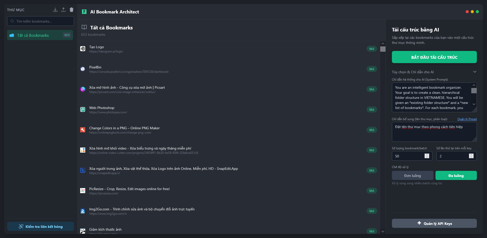
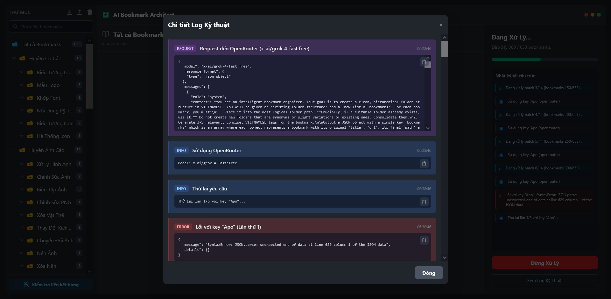
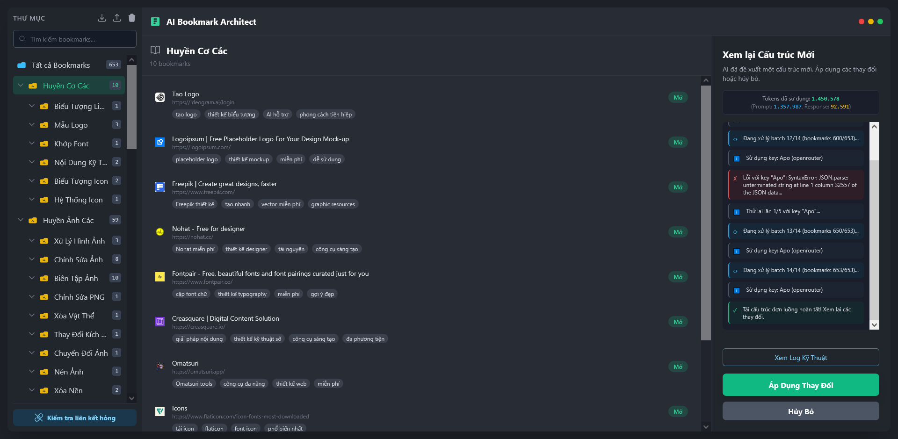

# AI Bookmark Architect

[](https://github.com/yana-arch/ai-bookmark-architect/releases)
[](https://reactjs.org/)
[](https://www.typescriptlang.org/)
[](https://vitejs.dev/)
[](LICENSE)

A sophisticated React-based application that leverages artificial intelligence to revolutionize bookmark organization. Using Google's Gemini AI, this tool intelligently restructures and categorizes your bookmarks, making information management effortless and intuitive.

## ✨ Features

- 🤖 **AI-Powered Restructuring**: Automatically categorize and organize bookmarks using advanced AI algorithms
- 🎯 **Folder Template System**: Pre-defined organizational templates for different use cases with strict category enforcement
- 🛠️ **AI Template Generation**: Create custom folder structures using natural language descriptions
- 📥 **Template Import/Export**: Share and backup your custom folder templates
- ☁️ **Cloud Database Sync**: Sync bookmarks across browsers/devices using PostgreSQL (Supabase/Neon)
- 🔐 **HTTPS Support**: Secure connections with HTTPS protocol enforcement
- 💾 **Local Storage**: Secure, offline-first storage using IndexedDB
- 🎨 **Modern UI**: Clean, responsive interface built with React and TypeScript
- ⚡ **Fast Performance**: Optimized with Vite for lightning-fast development and builds
- 🔒 **Privacy-Focused**: All processing happens locally with your API key

## 💻 Reviews

   

   <hr/>

   

   <hr/>

   

## 📋 Table of Contents

- [AI Bookmark Architect](#ai-bookmark-architect)
  - [✨ Features](#-features)
  - [💻 Reviews](#-reviews)
  - [📋 Table of Contents](#-table-of-contents)
  - [📋 Prerequisites](#-prerequisites)
  - [🚀 Installation](#-installation)
  - [⚙️ Configuration](#️-configuration)
  - [🎯 Usage](#-usage)
    - [Development Server](#development-server)
    - [Production Build](#production-build)
  - [📂 Folder Template System](#-folder-template-system)
    - [Default Templates](#default-templates)
    - [Using Templates](#using-templates)
    - [Template Management](#template-management)
    - [Custom Templates](#custom-templates)
  - [🛠️ Development](#️-development)
    - [Project Structure](#project-structure)
    - [Available Scripts](#available-scripts)
  - [🤝 Contributing](#-contributing)
  - [📄 License](#-license)
  - [🏗️ Technologies Used](#️-technologies-used)

## 📋 Prerequisites

- **Node.js**: Version 16.0.0 or higher
- **Gemini API Key**: Obtain from [Google AI Studio](https://makersuite.google.com/app/apikey)

## 🚀 Installation

1. **Clone the repository**:

   ```bash
   git clone https://github.com/yana-arch/ai-bookmark-architect.git
   cd ai-bookmark-architect
   ```

2. **Install dependencies**:

   ```bash
   npm install
   ```

3. **Configure environment** (see [Configuration](#configuration) section)

## ⚙️ Configuration

Create a `.env.local` file in the root directory:

```env
GEMINI_API_KEY=your_gemini_api_key_here
```

> **Security Note**: Never commit your API key to version control. The `.env.local` file is already included in `.gitignore`.

## 🎯 Usage

### Development Server

Start the development server with hot reload:

```bash
# Regular development (HTTP)
npm run dev

# HTTPS development (Recommended for cloud sync testing)
npm run dev-https
```

The application will be available at:
- HTTP: `http://localhost:3000`
- HTTPS: `https://localhost:3000`

### Production Build

```bash
npm run build
npm run preview
```

## 📂 Folder Template System

AI Bookmark Architect includes a powerful folder template system that allows you to create predefined organizational structures for your bookmarks. This ensures consistent categorization and provides AI guidance for specific use cases.

### Default Templates

The application comes with three built-in templates:

1. **Phát triển Web (Web Development)**
   - Frontend (React, Vue.js, Angular, HTML/CSS)
   - Backend (Node.js, Python, PHP, Database)
   - Công cụ & Tiện ích (Build Tools, Editors, Version Control)

2. **AI & Machine Learning**
   - Kiến thức cơ bản (Math, Algorithms, Concepts)
   - Frameworks & Libraries (TensorFlow, PyTorch, Keras, Scikit-learn)
   - Ứng dụng (NLP, Computer Vision, Robotics)

3. **Tổng hợp (General)**
   - Công nghệ (Programming, AI, Web)
   - Học tập (Tutorials, Courses, Documentation)
   - Công cụ (Development, Design, Productivity)

### Using Templates

1. **Select a Template**: In the restructure panel, expand the "Tùy chọn & Chỉ dẫn cho AI" section
2. **Choose from Dropdown**: Select a template from the dropdown menu
3. **Apply Template**: Click the "Áp dụng" (Apply) button to activate the template structure
4. **Run Restructuring**: Start the AI process - bookmarks will be organized strictly according to the template

### Template Management

- **Quản lý mẫu (Manage Templates)**: Access the full template management interface
- **AI Generation**: Create custom templates using natural language descriptions
- **Import/Export**: Share templates via JSON files
- **Template Mode**: When active, AI receives strict instructions to only use template-defined folders

### Custom Templates

Create your own templates using the AI-powered template generator or manually define folder structures. Templates are stored locally and can be exported for backup or sharing.

## 🛠️ Development

### Project Structure

```
ai-bookmark-architect/
├── components/                  # React components
│   ├── RestructurePanel.tsx    # Main panel with AI options & template selection
│   ├── FolderTemplateModal.tsx # Template management interface
│   ├── ApiConfigModal.tsx      # API configuration
│   ├── LogModal.tsx            # Processing logs viewer
│   └── ...                     # Other UI components
├── src/                         # Core application logic
│   ├── aiWorker.ts             # AI processing worker
│   ├── cache.ts                # Caching utilities
│   ├── performance.ts          # Performance monitoring
│   └── utils.ts                # Utility functions
├── types.ts                    # TypeScript type definitions
├── db.ts                       # Database operations
└── App.tsx                     # Main application component
```

### Available Scripts

- `npm run dev` - Start development server
- `npm run build` - Build for production
- `npm run preview` - Preview production build

## 🤝 Contributing

We welcome contributions! Please see our [Contributing Guidelines](CONTRIBUTING.md) for details.

1. Fork the repository
2. Create a feature branch: `git checkout -b feature/amazing-feature`
3. Commit your changes: `git commit -m 'Add amazing feature'`
4. Push to the branch: `git push origin feature/amazing-feature`
5. Open a Pull Request

## 📄 License

This project is licensed under the MIT License - see the [LICENSE](LICENSE) file for details.

## 🏗️ Technologies Used

- **Frontend Framework**: React 19.1.1
- **Language**: TypeScript 5.8.2
- **Build Tool**: Vite 6.2.0
- **AI Integration**: Google Gemini AI API
- **Database**: IndexedDB (via idb library)
- **Styling**: CSS Modules

---

<div align="center">
  <p>Built with ❤️ using React and AI</p>
  <p>
    <a href="#ai-bookmark-architect">Back to top</a>
  </p>
</div>
