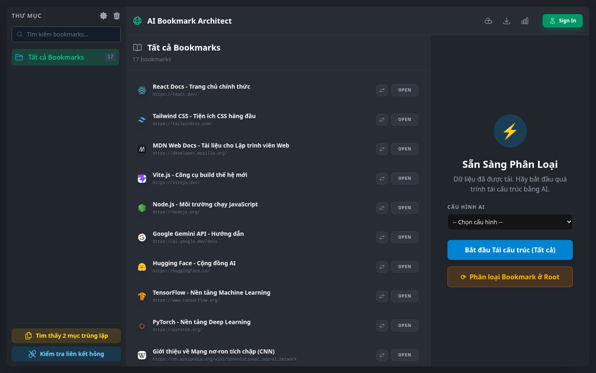
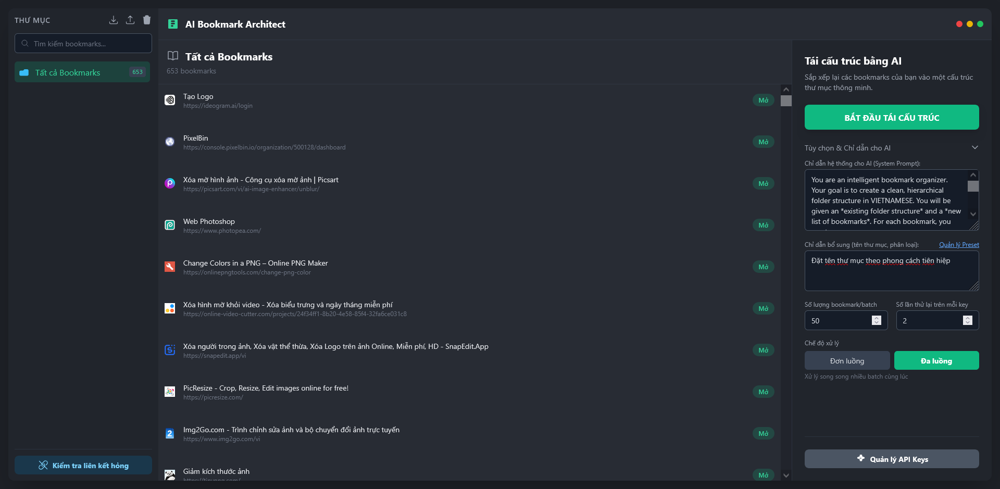
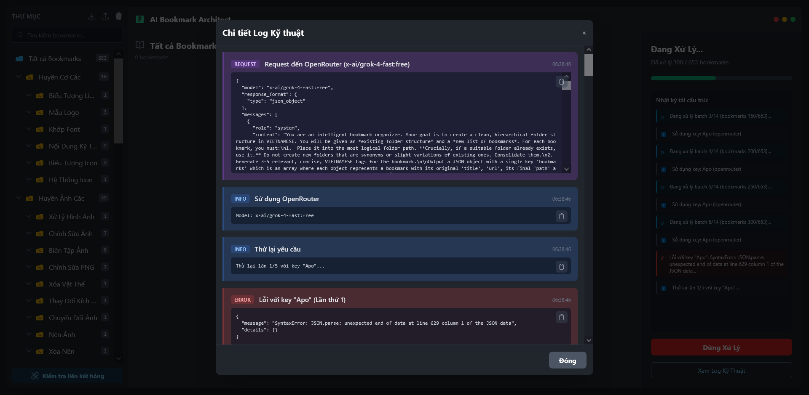
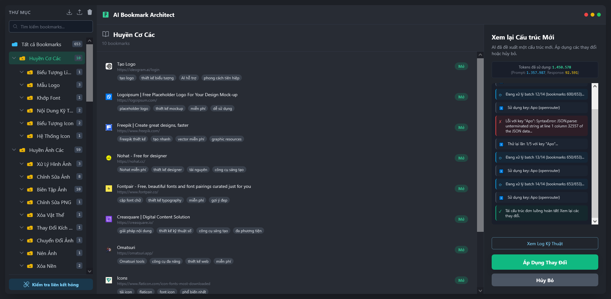
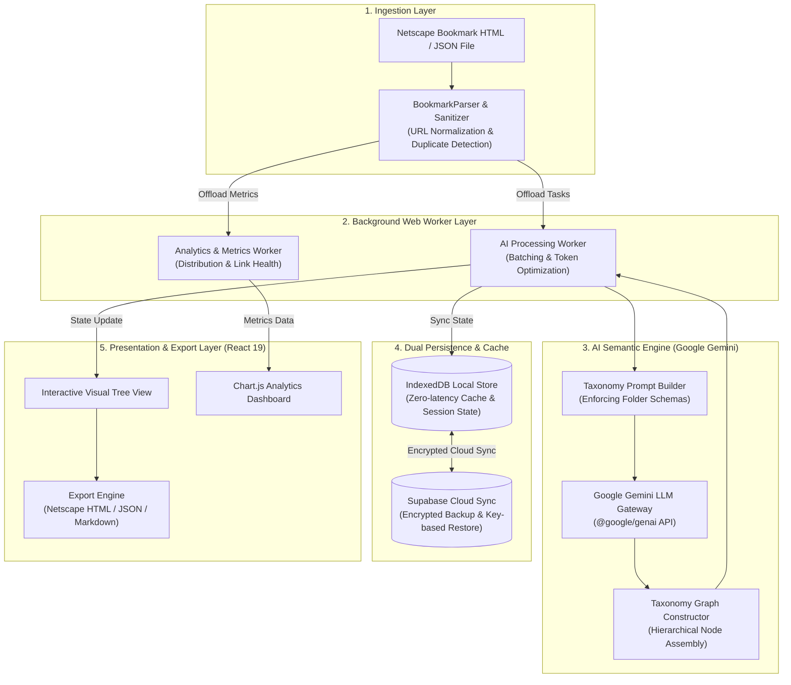

# AI Bookmark Architect — Intelligent Knowledge Graph Taxonomy & Bookmark Reorganizer

[](https://reactjs.org/)
[](https://www.typescriptlang.org/)
[](https://ai.google.dev/)
[](https://vitejs.dev/)
[](https://tailwindcss.com/)
[](https://supabase.com/)
[](https://vitest.dev/)
[](https://www.docker.com/)
[](LICENSE)


<div align="center">
  
</div>
---

## Executive Summary & Problem Statement

Modern knowledge workers save hundreds or thousands of browser bookmarks across disparate sessions, resulting in unstructured "bookmark graveyards" plagued by duplicated links, dead references, and incoherent folder hierarchies. Traditional bookmark managers require tedious manual filing and lack semantic understanding.

**AI Bookmark Architect** is an enterprise-grade, client-side web application and intelligent knowledge graph taxonomy engine. Powered by **Google Gemini AI** (`@google/genai`), it transforms chaotic browser bookmark exports (Netscape HTML & JSON) into structured, semantically grouped taxonomies. Designed with a high-concurrency **Web Worker** architecture, zero-latency **IndexedDB** local caching, and optional encrypted **Supabase** cloud synchronization, it delivers seamless reorganization without compromising browser responsiveness or data privacy.

---

## Visual Preview

<div align="center">
  
  <p><em>Figure 1: Interactive Netscape Bookmark Ingestion & Template Selection</em></p>
  <br/>
  
  <p><em>Figure 2: Non-blocking Web Worker AI Taxonomy Orchestration & Classification</em></p>
  <br/>
  
  <p><em>Figure 3: Semantic Graph Tree Hierarchy with Instant Export (HTML, JSON, Markdown)</em></p>
</div>

---

## System Architecture & Processing Pipeline

The system uses a non-blocking, multi-threaded pipeline where heavy parsing, graph clustering, and AI prompt batching are offloaded from the React 19 UI thread to background Web Workers.


```mermaid
flowchart TD
    subgraph Ingestion["1. Ingestion Layer"]
        InputHTML["Netscape Bookmark HTML / JSON File"]
        Parser["BookmarkParser & Sanitizer\n(URL Normalization & Duplicate Detection)"]
    end

    subgraph Concurrency["2. Background Web Worker Layer"]
        AIWorker["AI Processing Worker\n(Batching & Token Optimization)"]
        AnalyticsWorker["Analytics & Metrics Worker\n(Distribution & Link Health)"]
    end

    subgraph AIOrchestration["3. AI Semantic Engine (Google Gemini)"]
        PromptBuilder["Taxonomy Prompt Builder\n(Enforcing Folder Schemas)"]
        GeminiAPI["Google Gemini LLM Gateway\n(@google/genai API)"]
        TreeBuilder["Taxonomy Graph Constructor\n(Hierarchical Node Assembly)"]
    end

    subgraph StorageLayer["4. Dual Persistence & Cache"]
        IDBCache[("IndexedDB Local Store\n(Zero-latency Cache & Session State)")]
        SupabaseCloud[("Supabase Cloud Sync\n(Encrypted Backup & Key-based Restore)")]
    end

    subgraph Presentation["5. Presentation & Export Layer (React 19)"]
        TreeUI["Interactive Visual Tree View"]
        ChartUI["Chart.js Analytics Dashboard"]
        ExportEngine["Export Engine\n(Netscape HTML / JSON / Markdown)"]
    end

    %% Pipeline Connections
    InputHTML --> Parser
    Parser -->|Offload Tasks| AIWorker
    Parser -->|Offload Metrics| AnalyticsWorker

    AIWorker --> PromptBuilder
    PromptBuilder --> GeminiAPI
    GeminiAPI --> TreeBuilder
    TreeBuilder --> AIWorker

    AIWorker -->|Sync State| IDBCache
    AIWorker -->|State Update| TreeUI
    AnalyticsWorker -->|Metrics Data| ChartUI

    IDBCache <-->|Encrypted Cloud Sync| SupabaseCloud
    TreeUI --> ExportEngine
```

---

## Key Features & Capabilities

- **AI-Driven Semantic Graph Taxonomy**: Automatically classifies and nests bookmarks into coherent multi-level category trees using Google's Gemini models.
- **Dedicated Web Worker Architecture**: Offloads all heavy parsing, classification chunking, and metadata analytics to background threads (`aiWorker.ts` and `analyticsWorker.ts`), guaranteeing 60 FPS UI performance even with 10,000+ bookmarks.
- **Custom & Generative Folder Templates**:
  - Pre-packaged templates: *Developer Workspaces*, *Academic Research*, *Productivity & SaaS*, *Media & Entertainment*.
  - **Natural Language Template Generation**: Create custom taxonomic structures simply by describing your preferred schema in plain language.
  - Strict category validation rules to prevent taxonomy drift.
- **Dual-Tier Storage Architecture**:
  - **Offline-First IndexedDB** (`idb`): Retains complete working sessions and cache locally on the client.
  - **Optional Supabase Cloud Backup**: Securely store and retrieve structured bookmark trees across devices using private access keys.
- **Visual Analytics Dashboard**: Built-in **Chart.js** integration displaying domain distributions, category depth metrics, and tag heatmaps.
- **Universal Export Engine**: Export finalized bookmark hierarchies to standards-compliant Netscape Bookmark HTML (ready for Chrome/Firefox/Safari/Brave import), structured JSON, or Markdown documentation.
- **Comprehensive Test Coverage**: Unit and integration test suites powered by **Vitest 3** and **React Testing Library**.

---

## Tech Stack Breakdown

### Frontend Core
- **Framework**: React 19.1 (`react`, `react-dom`)
- **Language**: TypeScript 5.8 (Strict Type Safety)
- **Build Tool**: Vite 6.2
- **Styling**: Tailwind CSS 4.3 (`@tailwindcss/vite`) & PostCSS
- **Data Visualization**: Chart.js 4.4 & React-Chartjs-2 5.2

### AI & Cloud Services
- **AI SDK**: Google GenAI SDK (`@google/genai` v1.21.0)
- **AI Models**: Gemini Flash / Pro (configurable via API keys)
- **Cloud Backend**: Supabase JS Client (`@supabase/supabase-js` v2.78.0)
- **Local Storage**: IndexedDB Wrapper (`idb` v7.1.1)

### Quality Assurance & DevOps
- **Test Runner**: Vitest 3.0 (with Vitest UI & v8 Coverage)
- **Testing Utilities**: React Testing Library 16.3, DOM Testing Library, JSDOM
- **Linting**: ESLint 9 (Flat Config), typescript-eslint 8.53
- **Containerization**: Docker (Alpine multi-stage build) & Docker Compose

---

## Getting Started

### Prerequisites

- **Node.js**: v20.x or v22.x LTS
- **Package Manager**: npm (v10+)
- **Google Gemini API Key**: Obtain a free API key from [Google AI Studio](https://aistudio.google.com/)
- **Supabase Account** *(Optional)*: For cross-device cloud sync and backup

---

### Quickstart (Local Development)

1. **Clone the repository**:
   ```bash
   git clone https://github.com/yana-arch/ai-bookmark-architect.git
   cd ai-bookmark-architect
   ```

2. **Install dependencies**:
   ```bash
   npm install
   ```

3. **Configure Environment Variables**:
   Create a `.env.local` file in the project root:
   ```env
   # Required: Google Gemini AI API Key
   VITE_GEMINI_API_KEY=your_gemini_api_key_here

   # Optional: Supabase Cloud Sync
   VITE_SUPABASE_URL=https://your-project.supabase.co
   VITE_SUPABASE_ANON_KEY=your_supabase_anon_key
   ```

4. **Start Vite Development Server**:
   ```bash
   npm run dev
   ```
   Open your browser at `http://localhost:5173`.

---

### Quickstart with Docker

Build and run the containerized application:

```bash
docker-compose up --build -d
```
Access the application on the configured container port.

---

## Testing & Quality Control

AI Bookmark Architect maintains automated test suites to ensure data integrity during tree restructuring:

```bash
# Run all unit and component tests
npm run test

# Run tests with interactive Vitest UI
npm run test:ui

# Generate test coverage report
npx vitest run --coverage

# Run ESLint validation
npm run lint
```

---

## Project Directory Structure

```
ai-bookmark-architect/
├── Dockerfile                  # Multi-stage production container build
├── Dockerfile.dev              # Local development container definition
├── docker-compose.yml          # Container deployment specification
├── index.html                  # HTML5 entry template
├── package.json                # Project dependencies & scripts
├── vite.config.ts              # Vite 6 & Tailwind CSS 4 configuration
├── vitest.config.ts            # Vitest unit & integration test configuration
├── src/
│   ├── App.tsx                 # Root application component & layout shell
│   ├── index.tsx               # React DOM bootstrapping
│   ├── types.ts                # TypeScript interfaces (Node, Bookmark, Template)
│   ├── aiWorker.ts             # Web Worker for Gemini AI background processing
│   ├── analyticsWorker.ts      # Web Worker for bookmark metrics & health calculation
│   ├── cache.ts                # IndexedDB & in-memory LRU caching manager
│   ├── components/             # Reusable UI component modules
│   │   ├── features/           # Bookmark importer, tree viewer, template selector
│   │   ├── layout/             # Header, navbar, footer, sidebar components
│   │   ├── modals/             # Settings, Supabase config, custom template modals
│   │   └── ui/                 # Buttons, inputs, badges, spinners
│   ├── context/                # React contexts (Theme, Auth, BookmarkState)
│   ├── hooks/                  # Custom React hooks (useBookmarks, useWorkers)
│   ├── services/               # Core business & API services
│   │   ├── aiClient.ts         # Google GenAI SDK wrapper
│   │   ├── aiOrchestrator.ts   # Chunking, rate-limiting & retry coordination
│   │   ├── bookmarkParser.ts   # Netscape HTML & JSON parser
│   │   ├── promptBuilder.ts    # Dynamic prompt & template schema generator
│   │   └── supabaseBackupService.ts # Cloud backup & restore client
│   └── __tests__/              # Vitest test suites
```

---

## License & Author

- **Author**: Yana Arch & AI Bookmark Architect Contributors
- **License**: [MIT License](LICENSE)
